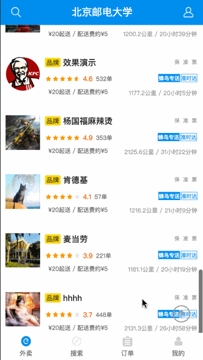
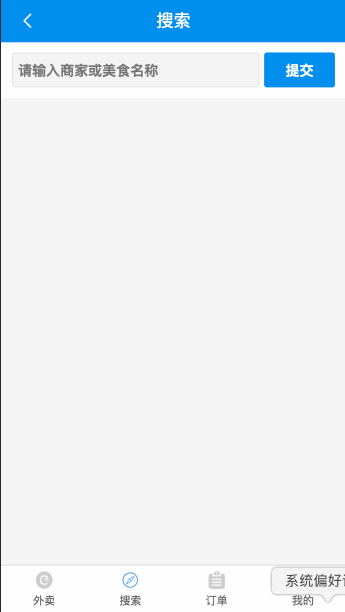
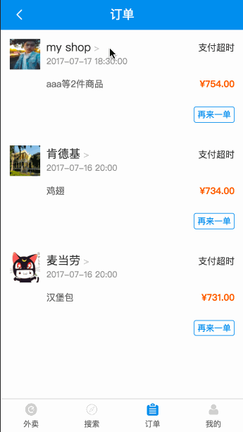
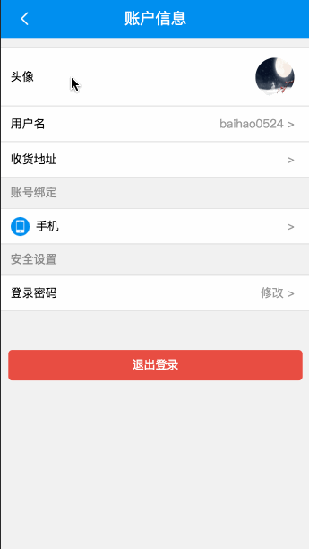

## 前言

在完成这个项目之前，我仅仅用过vue一款mvvm框架，如今前端格局，react，vue，angular三分天下，理解多种框架有助于选择正确的框架进行开发，做框架的主导者，而不是被框架驾驭～

初学react时曾在网上搜索react的实战项目源码，无奈大部分都是简单的demo，react并没有vue那么多的高仿网站（是不是黑了一波vue，尤大不要怼我2333），对于学习没有太大的帮助，我突然想到了vue很流行的饿了么高仿网站，于是便开始利用工作之余的时间进行开发。因为我以前完成的三个vue项目均有nodejs后台的实现，本项目仅仅为了学习react，加之工作繁忙，不想花费太多时间，本网站仅仅完成了前端部分～

## 技术栈

react + react-router + react-redux + webpack + less + es6/7 + flex

## 项目运行

<b>注意：由于涉及大量的 ES6/7 等新属性，nodejs 必须是 6.0 以上版本 ，node 7 是先行版，有可能会出问题，建议使用 node 6 稳定版</b>

```
	git clone git@github.com:mickey0524/react-ele.git  

	cd react-ele

	npm install

	npm run dev (本地运行)

	npm run dist (编译打包)
```
## 目录结构

```
|____.gitignore
|____index.html
|____LICENSE
|____package.json
|____README.md
|____server.js
|____src
| |____.DS_Store
| |____Component
| | |____.DS_Store
| | |____App.jsx
| | |____common
| | | |____bottomBar
| | | | |____bottomBar.jsx
| | | | |____bottomBar.less
| | | |____interval
| | | | |____interval.jsx
| | | | |____interval.less
| | | |____prompt
| | | | |____prompt.jsx
| | | | |____prompt.less
| | | |____questionMark
| | | | |____questionMark.jsx
| | | | |____questionMark.less
| | | |____shopList
| | | | |____mock.json
| | | | |____shopList.jsx
| | | | |____shopList.less
| | | |____template.jsx
| | | |____topBar
| | | | |____topBar.jsx
| | | | |____topBar.less
| | |____order
| | | |____childComponent
| | | | |____confirmOrder
| | | | | |____confirmOrder.jsx
| | | | | |____confirmOrder.less
| | | | |____orderDetail
| | | | | |____orderDetail.jsx
| | | | | |____orderDetail.less
| | | | |____orderIndex
| | | | | |____mockData.json
| | | | | |____orderIndex.jsx
| | | | | |____orderIndex.less
| | | | |____orderInvoice
| | | | | |____orderInvoice.jsx
| | | | | |____orderInvoice.less
| | | | |____orderNote
| | | | | |____mockData.json
| | | | | |____orderNote.jsx
| | | | | |____orderNote.less
| | | |____order.jsx
| | | |____order.less
| | |____payment
| | | |____payment.jsx
| | | |____payment.less
| | |____search
| | | |____mockData.json
| | | |____search.jsx
| | | |____search.less
| | |____shop
| | | |____childComponent
| | | | |____activityDetail
| | | | | |____activityDetail.jsx
| | | | | |____activityDetail.less
| | | | | |____mockData.json
| | | | |____goodList
| | | | | |____goodList.jsx
| | | | | |____goodList.less
| | | | | |____mockData.json
| | | | |____shopBanner
| | | | | |____mockData.json
| | | | | |____shopBanner.jsx
| | | | | |____shopBanner.less
| | | | |____shopDetail
| | | | | |____mockData.json
| | | | | |____shopDetail.jsx
| | | | | |____shopDetail.less
| | | | |____shopEvaluation
| | | | | |____mockData.json
| | | | | |____shopEvaluation.jsx
| | | | | |____shopEvaluation.less
| | | | |____shopIndex
| | | | | |____shopIndex.jsx
| | | | | |____shopIndex.less
| | | |____mockData.json
| | | |____shop.jsx
| | | |____shop.less
| | |____takeaway
| | | |____childComponent
| | | | |____variety
| | | | | |____mock.json
| | | | | |____variety.jsx
| | | | | |____variety.less
| | | |____takeaway.jsx
| | | |____takeaway.less
| | |____user
| | | |____.DS_Store
| | | |____childComponent
| | | | |____.DS_Store
| | | | |____account
| | | | | |____account.jsx
| | | | | |____account.less
| | | | | |____mockData.json
| | | | |____addAddress
| | | | | |____addAddress.jsx
| | | | | |____addAddress.less
| | | | |____address
| | | | | |____address.jsx
| | | | | |____address.less
| | | | |____balance
| | | | | |____balance.jsx
| | | | | |____balance.less
| | | | |____buyRecord
| | | | | |____buyRecord.jsx
| | | | | |____buyRecord.less
| | | | |____changePassword
| | | | | |____changePassword.jsx
| | | | | |____changePassword.less
| | | | |____exchangeCard
| | | | | |____exchangeCard.jsx
| | | | | |____exchangeCard.less
| | | | |____giftMoney
| | | | | |____giftMoney.jsx
| | | | | |____giftMoney.less
| | | | | |____mockData.json
| | | | |____integral
| | | | | |____integral.jsx
| | | | | |____integral.less
| | | | |____memberCard
| | | | | |____memberCard.jsx
| | | | | |____memberCard.less
| | | | |____questionDetail
| | | | | |____questionDetail.jsx
| | | | | |____questionDetail.less
| | | | |____serviceCenter
| | | | | |____mockData.json
| | | | | |____serviceCenter.jsx
| | | | | |____serviceCenter.less
| | | | |____setUserName
| | | | | |____setUserName.jsx
| | | | | |____setUserName.less
| | | | |____userIndex
| | | | | |____.DS_Store
| | | | | |____mockData.json
| | | | | |____userIndex.jsx
| | | | | |____userIndex.less
| | | |____user.jsx
| | | |____user.less
| |____Config
| | |____Config.js
| | |____fastclick.js
| | |____Tool.jsx
| | |____wx.js
| |____images
| | |____.DS_Store
| | |____account.png
| | |____add.png
| | |____back.png
| | |____bill-blue.png
| | |____bill-grey.png
| | |____car.png
| | |____color-stars_empty.png
| | |____color-stars_full.png
| | |____crown.png
| | |____eleme-blue.png
| | |____eleme-grey.png
| | |____gps.png
| | |____icon-service.png
| | |____market.png
| | |____navigation-blue.png
| | |____navigation-grey.png
| | |____online-server.png
| | |____phone-blue.png
| | |____phone-server.png
| | |____phone.png
| | |____placeholder-img.png
| | |____search.png
| | |____sub.png
| | |____top.png
| | |____trash.png
| | |____user-blue.png
| | |____user-grey.png
| | |____weixinzhifu.png
| | |____zhifubao.png
| |____index.jsx
| |____Redux
| | |____Action
| | | |____Index.jsx
| | |____Reducer
| | | |____Index.jsx
| | |____Store
| | | |____Store.jsx
| |____Router
| | |____order.jsx
| | |____Route.jsx
| | |____shop.jsx
| | |____user.jsx
| |____template
| | |____index.html
| |____Utils
| | |____changeTopBarStatus.js
| | |____dateForm.js
| | |____intersection-observer.js
|____webpack.config.dev.js
|____webpack.config.dist.js
|____webpack3.config.js

```

## 项目截图






注：此项目纯属个人瞎搞，正常下单请选择饿了么官方客户端。